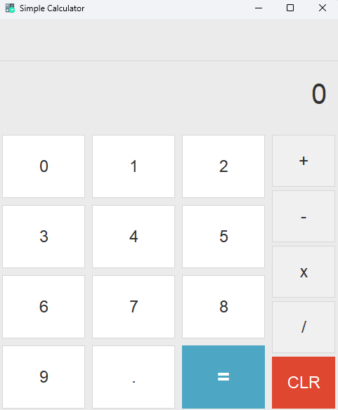
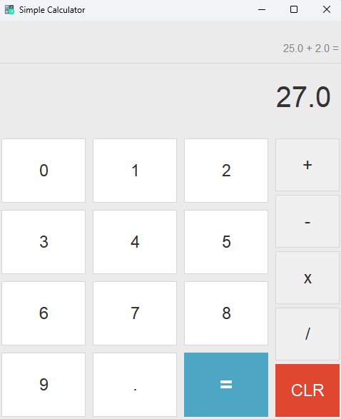

    

# Simple Calculator - Built in Java

The calculator is built in Java and performs basic operations.
You can use keypads, keyboard numbers and on-display buttons to perform the
calculations.

### Calculator Display
The calculator has a minimalistic view in terms of color and operations.

    

There are two displays on the calculator. The top display shows the expression entered by the user and
the second (bottom) display indicates the result and the current input by the user.

The top display has a smaller font and lighter gray color. The bottom (final calculation and user input) display
has a bold and darker color. This is used to help track the calculations and better for visuals.

    

##### Tooltips:
- The CLR button will clear the screen and reset all previous expressions.
- If you add 5 + 2 and press Enter, the display will show 7 as the result. If you press Enter again, the calculator will take the previous result and the second number (2 in this case) to perform another calculation.
- If the calculation was a subtraction, and the user presses Enter then the subsequent calculation will also be a subtraction

